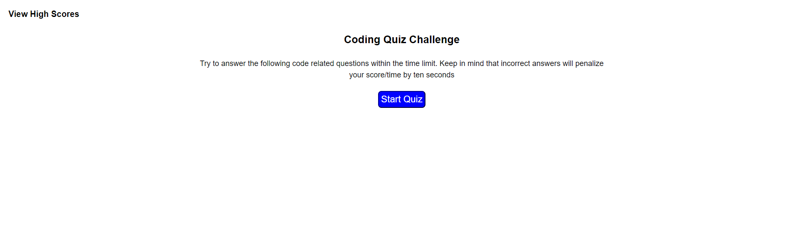

# Code-Quiz

## Description

This is a web site that quizzes the user on some coding question

Once the user starts the quiz the timer begins.
- There are 16 multiple choice question.
- If the user selects the wrong answer then a 10 second penalty is taken from the timer.
- The game will end once the user has completed all the questions or the timer has expired.
- The users score will be the amount of time that is left after all questions are answered.
- Scores can be added to the high score list where the user can add their initials.
- All saved scores are saved to the browsers local storage and persistant on page refreshes.
 

## Table of Contents

- [Deployed Link](#Link)
- [Screenshot](#Screenshot)
---

## Link

The link to the deployed website of the assignment is  
[https://jkoufalas.github.io/Code-Quiz/index.html](https://jkoufalas.github.io/Code-Quiz/index.html)

---
## Screenshot

This image provides a sample of the completed website.

